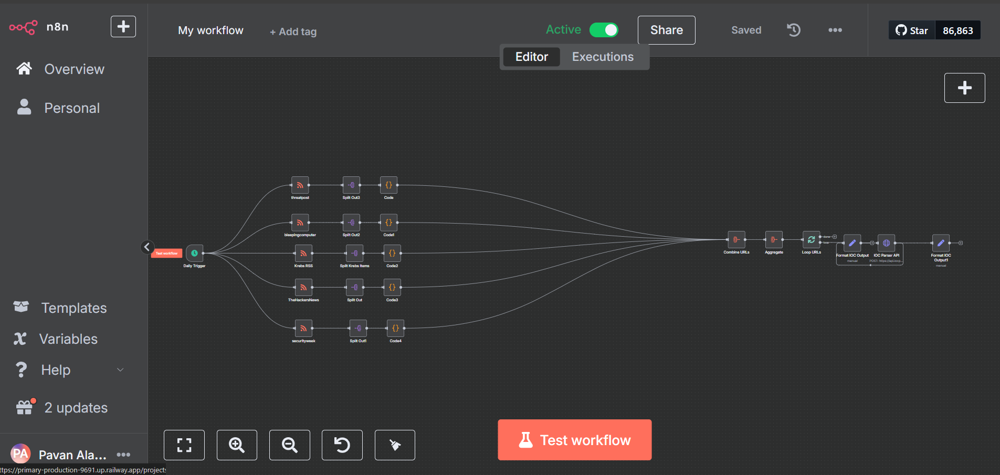

# Automated IOC Extraction and SIEM Integration using n8n

Automate fetching cyber threat reports, extracting Indicators of Compromise (IOCs) (domains, hashes, IPs, CVEs) using an API, and send structured IOCs into a SIEM for automated threat detection and hunting.




## Node-by-Node Deep Explanation:

#### Trigger Node — Daily Trigger
- This node starts the workflow automatically at a set time (e.g., once per day at 6 AM).
- Use the "Cron" trigger in n8n to run on a schedule.

#### RSS Feed Nodes — (threatpost, securityweek, ThehackersNews, bleepingcomputer, Krebs RSS)

- Fetch the latest articles or advisories from threat intel websites using RSS feeds.
- Each RSS node is configured with the corresponding website's feed URL.

#### Split Out Nodes — (Split Out1, Split Out2, etc.)

- Break the batch of RSS items into individual items (one article at a time).
- Standard "SplitInBatches" node with batch size = 1 or split arrays individually.

#### Code Nodes — (Code1, Code2, etc.)

- Extract URLs or essential text snippets from the articles for IOC analysis.
- Small JavaScript or Python snippets to, Extract URLs from the RSS link field.

````
const items = [];
const post = $item(0).$node["Split Out"].json;

if (post.link) {
  items.push({
    json: {
      url: post.link,
      source: "Name"
    }
  });
}

return items;
````

#### Combine URLs Node
- Aggregate all cleaned URLs from different feeds into one single array, Feeds the unified list to an aggregator for deduplication or structuring.


#### IOC Parser API Node

- Call the IOC Parser API to extract IOCs from the given URL.
```
HTTP Request node:

Method: POST

URL: (e.g., https://iocparserapi.com/parse)

Body: the formatted payload.
```

#### Format IOC Output (Post-API) Node

- Restructure API results into a format your SIEM expects.

````

[
{
"data": 
{
"FILE_HASH_SHA1": 
[
],
"DOMAIN": 
[
"theonlinesearch.com",
"smartwebfinder.com",
"toksearches.xyz"
],
"IPv6": 
[
],
"YARA_RULE": 
[
],
"IPv4": 
[
],
"EMAIL": 
[
],

````


### SIEM Integration

- Forward the final structured IOC data into a SIEM like Splunk, ElasticSearch (ELK), QRadar, etc.
- HTTP POST directly into the SIEM’s ingestion API (e.g., HEC for Splunk). Syslog output to send raw logs (can be done via n8n custom setup or external service).

````
URL: https://splunk.yourcompany.com:8088/services/collector
````
- Headers:
````
{
  "Authorization": "Splunk YOUR-HEC-TOKEN"
}
````

- Body:
````
{
  "event": {
    "ioc_type": "domain",
    "ioc_value": "malicious.com",
    "source": "Threatpost",
    "timestamp": "2025-04-29T06:00:00Z"
  }
}
````

flowchart TD
    A[Daily Trigger] --> B1[Fetch Threatpost RSS]
    A --> B2[Fetch BleepingComputer RSS]
    A --> B3[Fetch Krebs RSS]
    A --> B4[Fetch TheHackerNews RSS]
    A --> B5[Fetch SecurityWeek RSS]
    
    B1 --> C1[Split Out1] --> D1[Extract URLs - Code1]
    B2 --> C2[Split Out2] --> D2[Extract URLs - Code2]
    B3 --> C3[Split Out3] --> D3[Extract URLs - Code3]
    B4 --> C4[Split Out4] --> D4[Extract URLs - Code4]
    B5 --> C5[Split Out5] --> D5[Extract URLs - Code5]
    
    D1 --> E[Combine URLs]
    D2 --> E
    D3 --> E
    D4 --> E
    D5 --> E
    
    E --> F[Aggregate URLs]
    F --> G[Loop through URLs]
    G --> H[Format URL Payload]
    H --> I[IOC Parser API Call]
    I --> J[Format IOC Output for SIEM]
    J --> K[Send to SIEM]


### Key Advantages:- 
- Fully automated: No manual IOC collection.

- Faster detection: Instant IOC ingestion into SIEM.

-  Modular: You can easily add more RSS feeds, change API parser, or swap SIEM systems.

- Extendable: Add email notifications, Slack alerts, or blocklists integration later.


